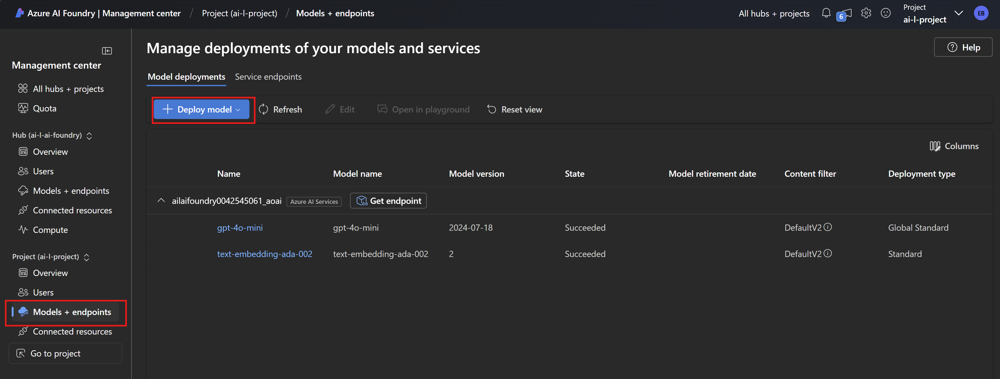
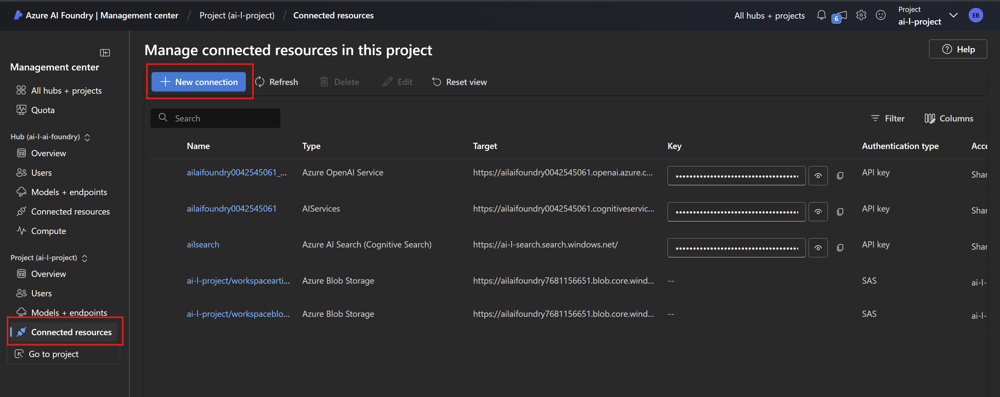
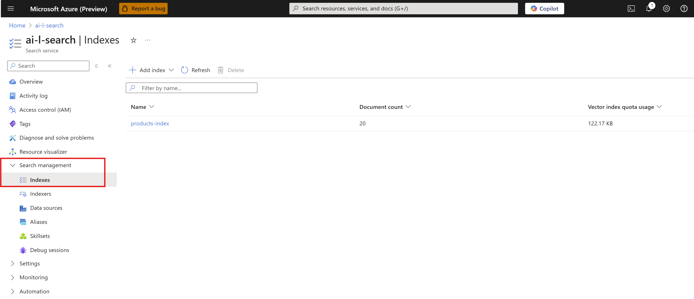
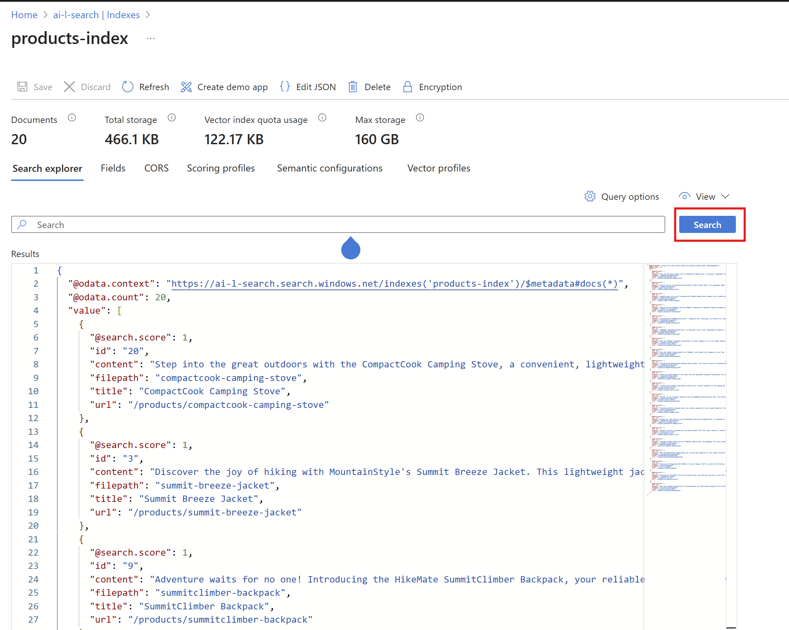

# Overview

Provides a simple build-your-own rag with Azure AI Foundry, AI Search and Azure OpenAI

## Setup

In your terminal, set up the following variables and run the Azure CLI commands to create the required resources. You can also use the Azure portal to create these resources.

```bash
# Set the following variables
LOCATION=<location>
RESOURCE_GROUP_NAME=<resource-group-name>
SEARCH_SERVICE_NAME=<search-service-name>
AI_FOUNDRY_SERVICE_NAME=<ai-foundry-service-name>
```

```bash
az login

# Provision the resource group
az group create --name $RESOURCE_GROUP_NAME --location $LOCATION

# Provision the Azure AI Search service
az search service create --name $SEARCH_SERVICE_NAME --resource-group $RESOURCE_GROUP_NAME --location $LOCATION --sku Standard

# Provision the Azure AI Hub (Foundry) service
# TODO: Confirm steps in doc: https://learn.microsoft.com/en-us/azure/ai-foundry/how-to/develop/create-hub-project-sdk?tabs=azurecli are correct and enough
az ml workspace create --kind hub --name $AI_FOUNDRY_SERVICE_NAME --resource-group $RESOURCE_GROUP_NAME
```

## Explanations for each step in the RAG

1. Add your data to your storage (local is used in this example); Optionally you can push it to Storage Account and add a simple logic to read data from blob
1. Exploratory Data Analysis - Inspect and understand your data
1. Indexing your data using Azure AI Search
   1. CONFIGURATION:
      1. Configuration your Azure AI Project Client
      1. Create client for embedding model (i.e., the embedding inference client)
      1. Retrieve a search connection object from AI Project instance
      1. Create search client for indexing using the connection object above
   1. INDEX DEFINITION:
      1. Set the right parameters/properties for the index for the data
      1. Choose the algorithm (cosine distance HNSW algo chosen here) for similarity; Uses semantic ranking
   1. INDEX CREATION:
      1. Using the specified index definition and embedding model, create an index
      1. Loads the data, generates embeddings/vectors
      1. Uploads the vectorized data into pre-defined search index
   1. Verify index is created
1. RETRIEVAL
   1. CONFIGURATION: similar as above to fetch model and search clients
   1. Receive input query from user
   1. Map user query to an intent (intent mapping - refer to the prompt used); this provides us the search query
   1. Create embedding or vectorize the search query
   1. Search the index for matches on the search query
   1. For each match, retrieve the document/content
   1. Return the document(s) to the user
1. AUGMENTATION + GENERATION
   1. Configure/Fetch the Azure AI Project Client
   1. Retrieve the Azure Open AI Chat Completions model inference client
   1. Use incoming user query to retrieve related product documents
   1. Use this knowledge to populate a "grounded" chat prompt template
   1. Call the chat completions inference client with the grounded prompt and generate a response for the user query
1. TEST/TRY IT OUT QUERY SAMPLES for the data
   1. "I need a new tent for 4 people, what would you recommend?"
   1. "Which tent is good for bug protection and rainy days?"
   1. "What food do cats like?" --> The response should be like "Sorry, I can only answer queries related to camping gear.."

## Getting Started

1. Use portal or infra scripts to create an `Azure AI Foundry` resource, which will generate an AI Hub.
1. After creating the resource, from the Overview page you can launch the *Azure AI Foundry portal*.
1. In the AI Foundry portal, create a new `AI Project`.
1. Deploy these 2 models, used for embedding and chat completions (and customizable in `.env` file):
   * `text-embedding-ada-002`
   * `gpt-4o-mini`

   

1. In Azure portal, create a new `Azure AI Search` resource, in the same resource group as the AI Foundry resource.
1. In VSCode, go to *rag/azure-ai-foundry* and ensure you copy `.env.template` to a new `.env` file.
1. Populate the `AIPROJECT_CONNECTION_STRING` - You can fetch this from Project Overview page in AI Foundry Portal: *Get API endpoints and keys*.
1. Create a virtual environment by running the following commands in VSCode terminal:

   ```bash
   python3 -m venv .aifoundryenv
   source .aifoundryenv/bin/activate
   ```

1. Install dependencies:

   ```bash
   cd rag/azure-ai-foundry/
   pip install -r requirements.txt
   ```

1. Login to your Azure subscription:

   ```bash
   az login
   ```

1. Run the configuration file, which will generate new resources in your Azure AI Foundry project, including a `workspaceblobstore` and a `workspaceartifactstore`:

   ```bash
   python config.py
   ```

1. Check the "Authentication Type" on the `workspaceblobstore` and `workspaceartifactstore` by selecting each of them in the Overview page of your AI Project. By default, it should be *Credential based*. If it's *Account Key based* authentication, then ensure that the Storage Account has *Account Key Access* Enabled in the Configuration settings.

1. Ensure the user has *Blob Data Contributor* access on the Storage Account, and *Search Index Data Contributor* access on the Azure AI Search resource. Follow below steps to set it right:

   1. Fetch the id of your user

      ```bash
      az ad signed-in-user show
      ```

      Note: if you need the id of a different user, you can use the following command, replacing the email address with the proper one: `az ad user list --filter "mail eq 'your-email@microsoft.com'" --output json`*

   1. Copy the object id for the respective user

   1. Assign the roles to the user, replacing the placeholder items as explained below.

      ```bash
      az role assignment create --role "Storage Blob Data Contributor" --scope /subscriptions/<mySubscriptionID>/resourceGroups/<myResourceGroupName>/providers/Microsoft.Storage/storageAccounts/<myStorageAccountName> --assignee-principal-type User --assignee-object-id "<user-id>"

      az role assignment create --role "Search Index Data Contributor" --scope /subscriptions/<mySubscriptionID>/resourceGroups/<myResourceGroupName>/providers/Microsoft.Search/searchServices/<mySearchServiceName> --assignee-principal-type User --assignee-object-id "<user-id>"
      ```

      `mySubscriptionID`: Subscription ID of the Azure AI Studio Hub's linked storage account (available in Azure AI Hub resource view in Azure Portal).

      `myResourceGroupName`: Resource group of the Azure AI Studio Hub's linked storage account.

      `user-id`: User object ID for role assignment, retrieved on step 4a.

      `myStorageAccountName`: Storage account name of the Azure AI Studio Hub's linked storage account.

      `mySearchServiceName`: Azure AI Search service name of the Azure AI Studio Hub's linked search service.

1. In the AI Foundry portal, link the Azure AI Search resource to the AI Project, by clicking on the `New Connection` button in the `Connections` tab of the AI Project. Select the `Azure AI Search` connection type and you should automatically see your resource. If not, you can manually provide the required information.

   

1. Search Index Definition and Creation:

   ```bash
   python create_search_index.py
   ```

   Once the command completes, you should see the index created in the Azure AI Search resource.

   
   

1. Retrieve Product Documents:

   ```bash
   python get_product_documents.py
   ```

   You will be prompted for a user query; optionally you can pass it in as a command line argument; see code file

1. Chat with Products (Generate a response for user query instead of list of documents):

   ```bash
   python chat_with_products.py

   # optionally you can pass query as a command line argument
   python chat_with_products.py --query "What is the best tent for families?"
   ```
